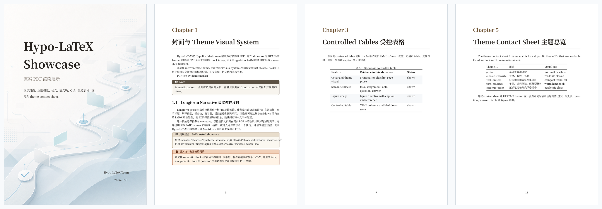

# Hypo-LaTeX

[](pyproject.toml)
[](spec/hypodoc/spec/hypodoc-markdown.md)
[](pyproject.toml)
[](#当前状态)
[](LICENSE)

Hypo-LaTeX 是 **HypoDoc Markdown 的 LaTeX/PDF 渲染器、CLI、LaTeX 宏包、主题集合和 AI Skill**。

它的目标不是让作者直接维护复杂 LaTeX，而是让 AI 和人类维护结构化 Markdown 源文件，再通过稳定的 LaTeX 后端生成可审阅的 TeX 与 PDF。当前重点场景包括长文教程、项目/作业文档、复习题文档、表格密集资料，以及后续可扩展的更多 HypoDoc 渲染目标。




## 当前状态

Hypo-LaTeX 目前处于早期预览和活跃开发阶段。

当前版本已经可以用于本地实验、内部文档生产和可审阅 PDF 生成，但 HypoDoc Markdown 0.1 草案、CLI 细节和主题接口仍可能变化。Hypo-LaTeX 还没有发布到 CTAN 或 PyPI。

## 仓库定位

HypoDoc 是文档格式家族。这个仓库是其中的 LaTeX/PDF 渲染实现：

- **HypoDoc Markdown**：AI-first 的结构化 Markdown 源格式。
- **HypoDoc Spec**：独立的格式规范草案，在本仓库中通过 `spec/hypodoc` submodule 引入。
- **Hypo-LaTeX**：本仓库，包含 `hypolatex` CLI、Pandoc Lua filter、LaTeX 宏包、主题、模板、测试和 AI Skill。

普通 PDF 构建不依赖 spec submodule。只有在开发或同步 HypoDoc Markdown 格式规范时才需要它。

## 能做什么

- 将 HypoDoc Markdown 转换为可审阅的 LaTeX。
- 通过 Pandoc、XeLaTeX 和 `latexmk` 构建 PDF。
- 提供面向中文长文的 CJK 友好主题和字体配置。
- 支持项目、作业、教学、复习题等语义模块。
- 支持 `student`、`review`、`teacher` 三种答案可见性模式。
- 提供 Markdown + YAML 的受控表格 DSL，用于可预测的 PDF 表格。
- 提供 AI-readable Skill，让 agent 可以检查环境、维护 Markdown、构建 PDF 并收集 PDF 验证证据。

## 快速开始

如果你要开发或同步 HypoDoc Markdown 规范，使用 submodule 克隆：

```bash
git clone --recurse-submodules <repo-url>
cd hypodoc-latex
```

普通渲染器使用者也可以正常克隆。

安装本地开发依赖：

```bash
uv sync
```

检查构建环境：

```bash
uv run hypolatex doctor
```

从模板构建一个长文 PDF：

```bash
uv run hypolatex build skill/templates/longform.md \
  --theme classic-readable \
  --output build/longform.pdf
```

只生成可审阅 TeX：

```bash
uv run hypolatex convert skill/templates/longform.md \
  --output build/longform.tex
```

构建带答案的复习题版本：

```bash
uv run hypolatex build skill/templates/review.md \
  --answer-mode review \
  --output build/review.pdf
```

## AI Skill

AI 使用的 Skill 位于：

```text
skill/SKILL.md
```

当你希望 AI 维护 HypoDoc Markdown 并通过 Hypo-LaTeX 输出 PDF 时，可以把这个 Skill 给 agent 使用。Skill 会要求 agent 先运行 `hypolatex doctor`，使用以 `theme:` 为核心的 frontmatter，只使用已支持的语义块和 DSL，构建 PDF 后用 PDF 工具检查输出证据。

## HypoDoc Markdown 代表性片段

最小 frontmatter：

```yaml
---
title: Example Document
author: Example Author
theme: classic-readable
---
```

语义模块：

```markdown
::: {.task title="实现任务"}
构建 PDF，并记录验证命令和输出位置。
:::
```

复习题：

```markdown
::: {.question title="开放推理题" style="plain"}
解释为什么构建前需要先运行环境检查。
:::

::: {.answer title="参考答案" style="plain"}
因为 PDF 构建依赖 Pandoc、XeLaTeX、latexmk 和 LaTeX package；提前检查可以避免后续失败难以定位。
:::
```

固定位置图片：

```markdown
::: {.figure label="fig:workflow" src="assets/workflow.png" caption="Workflow overview" width="0.92" placement="H"}
:::
```

更多语义块、复习题组合、表格 DSL 和主题配置见：

- `docs/examples.md`
- `docs/themes.md`
- `docs/user-guide.md`

## 主题

当前公开主题预设：

- `plain`：基础兼容和调试。
- `classic-readable`：可读性优先的长文、教程和书籍。
- `tech-minimal`：技术指南、模型评测、榜单和表格密集资料。
- `warm-handbook`：更亲和的手册、课程笔记和解释型材料。
- `academic-clean`：正式笔记和研究风格报告。

详细选择规则、字体角色和高级覆盖项见 `docs/themes.md` 与 `docs/fonts.md`。

## 文档

- HypoDoc Markdown 规范：`spec/hypodoc/spec/hypodoc-markdown.md`
- 用户指南：`docs/user-guide.md`
- 示例集合：`docs/examples.md`
- 主题说明：`docs/themes.md`
- 开发者指南：`docs/developer.md`
- CLI 参考：`docs/reference/cli.md`
- C3 写作指南：`docs/c3-authoring.md`
- 语义模块设计：`docs/semantic-modules.md`
- 图片说明：`docs/figures.md`
- 字体说明：`docs/fonts.md`
- 封面布局：`docs/cover-layouts.md`

## 当前限制

- HypoDoc Markdown 0.1 仍是草案。
- XeLaTeX 是当前主要 PDF 构建路径。
- Beamer/slides 尚未实现。
- 受控表格暂不支持 row span 或 column span。
- 长表格目前使用 `longtable` fallback，而不是完整 `longtblr`。
- HTML、VSCode preview、desktop app 等渲染器属于未来 HypoDoc 仓库。

## 许可证

MIT.
